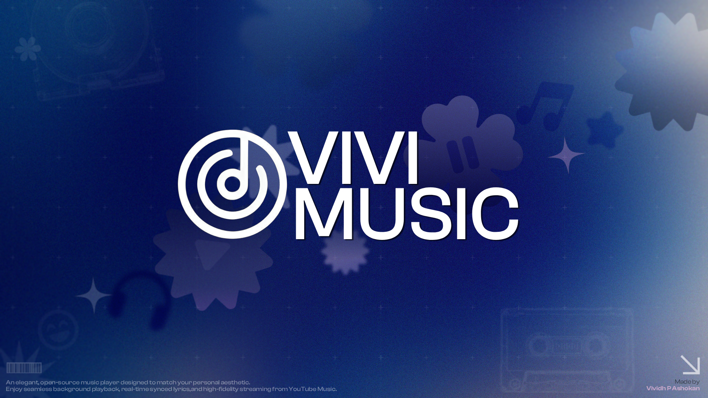



# Welcome to VIVI-MUSIC

**An ecosystem designed for a premium, uninterrupted music streaming experience on Android.**

 

## Who We Are

The VIVI-MUSIC GitHub organization serves as the central hub for the entire VIVI ecosystem. Here, you'll find the core Android application, our backend synchronization services (like Listening Together), web interfaces, continuous playback modules, and other open-source projects that power the app.

We believe in creating high-quality, visually stunning software that prioritizes user experience above all else.

## Core Repositories

| Project | Overview | Primary Stack |
|---|---|---|
| [**vivi-music**](https://github.com/vivizzz007/vivi-music) | The main Android streaming application featuring a modern Material 3 interface. | Kotlin |
| [**VIVI-SERVER**](https://github.com/ViviMusicGroup/VIVI-SERVER) | The real-time synchronization engine facilitating shared listening sessions. | Backend |
| [**vivi-playerx**](https://github.com/ViviMusicGroup/vivi-playerx) | Robust background node for maintaining playback decryption and continuous signature updates. | Automation |
| [**vivimusicanvas**](https://github.com/ViviMusicGroup/vivimusicanvas) | Experimental module dedicated to rendering dynamic and animated background canvases. | Web |
| [**vivi-music-website**](https://github.com/ViviMusicGroup/vivi-music-website) | The source code for our promotional landing page and web platform. | Frontend |

## Community & Support

We highly encourage developers and users alike to get involved with the project!

- **Reporting Issues:** Spot an issue? Feel free to open a ticket in the corresponding repository above.
- **Connect With Us:** Come hang out with the team and other community members on our [Telegram channel](https://t.me/vivimusicapp).

## Legal Notice

VIVI-MUSIC is an independent, community-driven project. It is strictly not endorsed by, affiliated with, maintained, authorized, or sponsored by Google LLC or any corporate streaming platforms. All product names, logos, and brands are property of their respective owners.

---

<b>Developed with ❤️ exclusively for the community by VIVIDH</b>

